<div align="center">
  
</div>

<div align="center">
  <a href="https://x.com/ashmitjrdev"></a>
  &nbsp;
  <a href="https://linkedin.com/in/ashmittudu"></a>
  &nbsp;
  <a href="https://brutaltalks.tech"></a>
  &nbsp;
  <a href="mailto:ashmit4works@gmail.com"></a>
  &nbsp;
  
</div>

<br/>

```
  I didn't start with a course.  I started with curiosity.
  Class 8. No mentor. No roadmap. Just a laptop and the internet.
  That became an obsession — building interfaces people haven't seen before.
```

```js
const ashmit = {
  role     : "Creative Frontend Engineer",
  age      : 16,
  location : "West Bengal, India 🇮🇳",
  building : ["Mitsu Motion 🎞", "Portfolio", "Client Work"],
  stack    : ["React", "Next.js", "GSAP", "Framer Motion", "TypeScript", "WebRTC"],
  openTo   : "Freelance — landing pages · animated UIs · frontends that stand out",
  contact  : "ashmit4works@gmail.com",
};
```

<br/>

---

<h2>◼ &nbsp; PROJECTS</h2>

<table width="100%">
<tr>
<td width="50%" valign="top" align="left">

### 🖥 &nbsp; KyrenOS
```
Browser-based OS built in React.
Draggable windows · Boot sequence
Real-time internet speed + battery.
```
> **Ranks #1 on Google &nbsp;·&nbsp; Cloned by foreign devs**


**[→ &nbsp;Live](https://kyrenos.vercel.app)** &nbsp;&nbsp; **[→ &nbsp;Code](https://github.com/ashmitjr/KyrenOS)**

</td>
<td width="50%" valign="top" align="left">

### 💬 &nbsp; BrutalTalks
```
Omegle-style P2P video chat.
No accounts. No data. No trace.
Custom signaling server from scratch.
```
> **WebRTC &nbsp;·&nbsp; Live at brutaltalks.tech**


**[→ &nbsp;Live](https://brutaltalks.tech)** &nbsp;&nbsp; **[→ &nbsp;Code](https://github.com/ashmitjr/Brutaltalks)**

</td>
</tr>
<tr>
<td width="50%" valign="top" align="left">

### 🎬 &nbsp; CinemaTrial
```
Full stack movie discovery platform.
PostgreSQL · Drizzle · JWT · Redux
Admin dashboard · Rate limiting.
```
> **Built for a selection task &nbsp;·&nbsp; Chosen top 3**


**[→ &nbsp;Live](https://cinema-hall-neon.vercel.app)** &nbsp;&nbsp; **[→ &nbsp;Code](https://github.com/ashmitjr/CinemaHall)**

</td>
<td width="50%" valign="top" align="left">

### 🛋 &nbsp; Sofa.AI
```
Rebuilt a Framer template in React.
GSAP ScrollTrigger · Parallax
Bento grid · Scroll animations.
```
> **Pixel perfect &nbsp;·&nbsp; Challenged myself · Delivered**


**[→ &nbsp;Live](https://sofaai-ashmitjr.vercel.app)** &nbsp;&nbsp; **[→ &nbsp;Code](https://github.com/ashmitjr/Sofa-AI)**

</td>
</tr>
</table>

<br/>

---

<h2>◼ &nbsp; STACK</h2>

<div align="center">


</div>

<br/>

---

<h2>◼ &nbsp; STATS</h2>

<div align="center">
  
  
</div>

<div align="center">
  
</div>

<br/>

---

<h2>◼ &nbsp; CURRENTLY BUILDING</h2>

<div align="center">

```
 ╔══════════════════════════════════════════════════╗
 ║                                                  ║
 ║   MITSU MOTION  ·  Premium Animation Library     ║
 ║                                                  ║
 ║   GSAP  ·  Framer Motion  ·  Three.js  ·  WebGL  ║
 ║                                                  ║
 ║   Most devs use animation libraries.             ║
 ║   I build them.                                  ║
 ║                                                  ║
 ╚══════════════════════════════════════════════════╝
```

</div>

<br/>

---

<div align="center">

```
  ◼  OPEN FOR FREELANCE
  Landing pages  ·  Animated UIs  ·  Frontends that stand out
  ashmit4works@gmail.com
```

</div>
